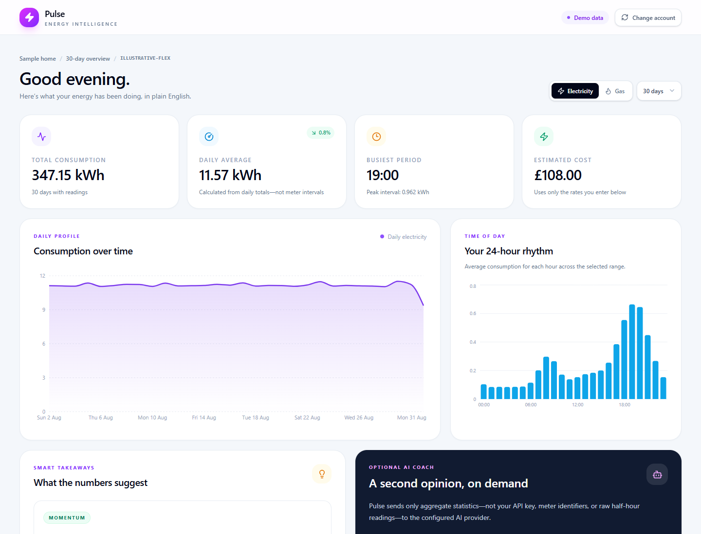
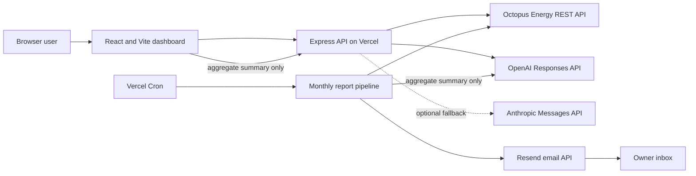

# Pulse Energy Dashboard

> **Parked project:** this repository is preserved as a working portfolio and learning reference. It is not under active feature development. See [project status](docs/PROJECT_STATUS.md) before deploying or reviving it.

Pulse is a privacy-conscious React dashboard for exploring Octopus Energy smart-meter data. It discovers the meters on an account, turns half-hourly readings into daily and hourly patterns, estimates electricity cost from user-supplied tariff rates, and can request aggregate-only coaching from OpenAI with an optional Anthropic fallback.

[Open the live demo](https://octopus-energy-app-psi.vercel.app) · [Read the user guide](docs/USER_GUIDE.md) · [Explore the architecture](docs/ARCHITECTURE.md)



## What the project demonstrates

- a credential-free interactive demo with generated electricity and gas readings;
- live Octopus account and consumption retrieval through a server-side proxy;
- London-time daily aggregation and a 24-hour usage profile;
- electricity cost estimates using rates supplied in the browser;
- deterministic local insights plus optional aggregate-only AI coaching;
- OpenAI as the primary AI provider with Anthropic fallback;
- a private monthly Vercel Cron job that emails the owner through Resend;
- input validation, origin controls, request timeouts, trusted pagination and bounded in-memory rate limiting.

The project is independent and is not affiliated with Octopus Energy.

## How it fits together



The browser never calls Octopus or an AI provider directly. Interactive credentials are held in React state, sent to this app's API for the request and not written to browser storage by the application. The monthly job uses separate server-only environment variables. See [Architecture](docs/ARCHITECTURE.md) for the full request sequences and trust boundaries.

## Try it safely

The fastest route is **View the interactive demo** on the landing page. It needs no account, API key or backend integration and supports the same range, fuel, chart, tariff and local-insight controls as live mode.

Live mode requires an Octopus Energy account number and API key. Octopus documents the account and consumption endpoints in its [official REST API guide](https://developer.octopus.energy/guides/rest/api-endpoints/). Never commit an API key or paste it into a deployment you do not control.

For detailed steps, tariff guidance and troubleshooting, use the [User guide](docs/USER_GUIDE.md).

## Local development

Requirements:

- Node.js compatible with the checked-in Vite and package lock;
- npm;
- optional Octopus, OpenAI, Anthropic and Resend credentials for integration testing.

```powershell
git clone https://github.com/FLABDUL/octopus-energy-app.git
cd octopus-energy-app
npm install
npm --prefix server install
Copy-Item server\.env.example server\.env
npm run dev:all
```

Open the URL printed by Vite, normally `http://localhost:5173`. The demo works with an empty `server/.env`.

Quality checks:

```powershell
npm test
npm run lint
npm run build
```

Do not run the monthly endpoint against real credentials merely to test the UI: it can send an email. The development guide explains dependency injection used by the automated tests and the guarded test-mode endpoint.

## Documentation

| Guide | Purpose |
| --- | --- |
| [User guide](docs/USER_GUIDE.md) | Demo and live-account usage, tariff inputs, AI coaching and troubleshooting |
| [Architecture](docs/ARCHITECTURE.md) | Components, data flows, privacy boundaries and design decisions |
| [Development](docs/DEVELOPMENT.md) | Setup, environment variables, endpoints, testing and deployment |
| [Project status](docs/PROJECT_STATUS.md) | Archived scope, known limitations, maintenance risks and revival checklist |

## Important limitations

- This is a personal analytics tool, not a billing system. Cost values are estimates and should be checked against an Octopus bill.
- Cost estimation covers electricity only. Gas is displayed in the units returned by Octopus because gas representation can vary by meter generation.
- Missing smart-meter readings cannot be repaired by the app. Gas may be absent when Octopus has not exposed readings for the meter.
- The dashboard does not forecast bills, calculate time-of-use tariff prices or control devices.
- A public deployment has no user authentication. Do **not** expose owner dashboard credentials through `OCTOPUS_API_KEY` and `OCTOPUS_ACCOUNT_NUMBER` without adding access control.
- A configured interactive AI key can incur provider cost for public visitors. The existing in-memory limiter is not a substitute for authentication or distributed rate limiting.
- Dependency and model versions are a preserved 2026 snapshot. Verify provider APIs and supported model identifiers before reviving the project.

## Licence

Released under the [MIT Licence](LICENSE). Octopus Energy, OpenAI, Anthropic, Resend and Vercel names and services remain subject to their own terms.
