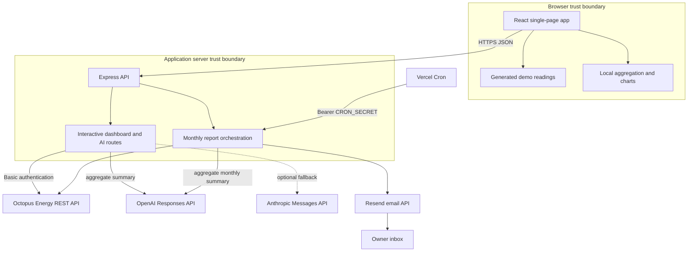
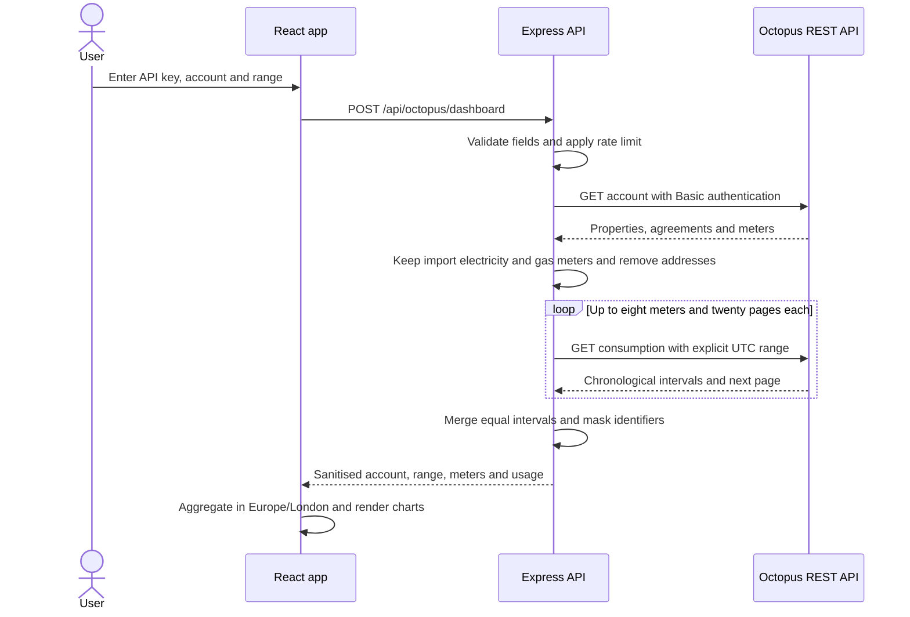
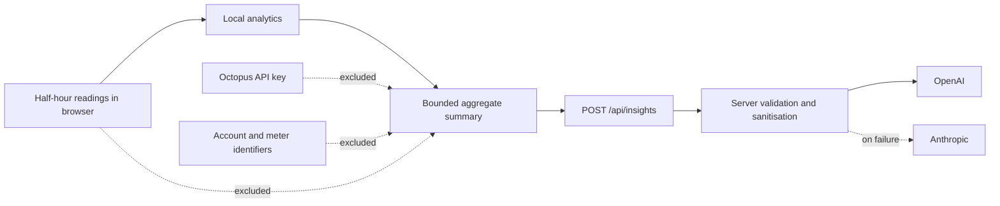
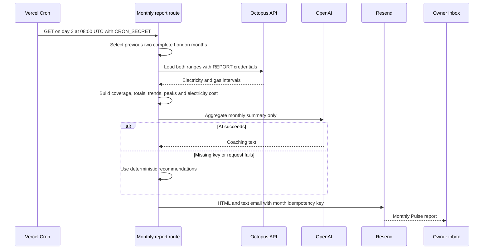
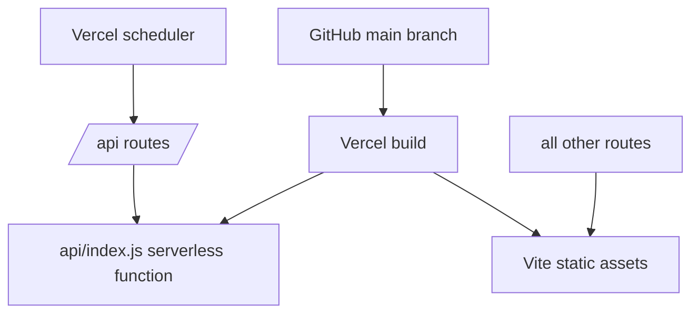

# Architecture

Pulse is a single-page React application backed by a small Express service. Vercel serves the static Vite build and exposes the same Express app through one serverless function. The code deliberately separates interactive visitor credentials from the owner's scheduled-report credentials.

## System context

## Interactive dashboard sequence

In demo mode, `createDemoDashboard` replaces the server and Octopus portion of this sequence with synthetic half-hour data generated in the browser.

## Interactive AI privacy flow

The server accepts only a fixed set of summary fields, clamps numbers and string lengths, and builds its own prompt. The provider response is displayed as plain React text rather than injected HTML.

## Monthly report sequence

The production idempotency key is `pulse-monthly-YYYY-MM`. Test mode adds a timestamp and is intentionally non-idempotent.

## Component map

| Path | Responsibility |
| --- | --- |
| `src/App.jsx` | Connection form, dashboard composition, fetch orchestration and interactive state |
| `src/lib/demo.js` | Synthetic half-hour electricity and gas data |
| `src/lib/energy.js` | London-time aggregation, estimates and local insights |
| `server/index.js` | Express app, health, validation, CORS, rate limits and route wiring |
| `server/octopus.js` | Octopus authentication, sanitisation, pagination and merging |
| `server/insights.js` | Aggregate sanitisation, prompts, OpenAI primary and Anthropic fallback |
| `server/monthly-analytics.js` | Complete-month boundaries, coverage, trends and metrics |
| `server/monthly-report.js` | Owner report orchestration and safe AI fallback |
| `server/report-email.js` | Escaped HTML/plain-text rendering and Resend delivery |
| `api/index.js` | Vercel serverless adapter around Express |
| `vercel.json` | Static/API rewrites and monthly cron schedule |

## Data model and transformations

Octopus account data is reduced to an account number, property labels, fuel, masked meter identifiers, masked serials and current tariff codes. Address fields are discarded. Consumption intervals retain only `interval_start`, `interval_end` and `consumption`.

The server requests UTC boundaries and chronological ordering. The client and monthly analytics group readings using `Europe/London`, so British Summer Time transitions follow local calendar days. Multiple meter series for the same fuel are summed when timestamps match.

Interactive cost is calculated only for electricity and only from the rates held in browser memory. The monthly pipeline uses separate server-side tariff assumptions. Neither path attempts bill reconciliation.

## Deployment topology

Local development runs Vite, normally on port 5173, and Express on port 3001. Vite proxies `/api` to Express.

## Security and privacy boundaries

Implemented controls:

- browser credentials are not persisted by application code;
- account addresses are stripped and meter identifiers are masked;
- request bodies are capped at 100 KB;
- account number, day range and AI summary fields are validated;
- Octopus requests have a 15-second timeout, bounded pagination and origin-checked next links;
- interactive routes use per-process in-memory rate limits;
- the cron route requires an exact bearer secret;
- monthly dashboard and AI credentials use separate environment names;
- provider prompts exclude keys, account numbers, meter identifiers and raw readings;
- email content and AI text are escaped before HTML rendering;
- public 5xx responses do not reveal internal provider errors.

Known gaps for a public multi-user revival:

- no user authentication or account ownership proof;
- rate limits are not shared across serverless instances;
- a server-configured interactive Octopus account would be accessible to visitors;
- a public interactive AI route can consume the owner's provider credit;
- no durable audit trail, job state, monitoring or alerting;
- no secrets rotation workflow or automated dependency scanning in this repository.

The right revival design is to add authentication and per-user encrypted credential storage or OAuth, use a distributed limiter, separate public demo and private account deployments, and add provider observability before expanding access.

## Design decisions

**Server-side provider calls.** API keys are not bundled into the static client, and Octopus account payloads can be sanitised before returning them.

**Local chart analytics.** Range and tariff interactions recalculate immediately without another provider call.

**Aggregate-only AI.** The AI coach receives enough context for general pattern commentary without raw behavioural time series or meter identity.

**Separate monthly secrets.** Public dashboard requests cannot fall back to `REPORT_*` credentials.

**Deterministic fallback email.** A provider outage does not prevent the owner from receiving a useful monthly summary.

**No gas cost claim.** The preserved project avoids silently converting potentially ambiguous gas readings.

[Back to the README](../README.md)
